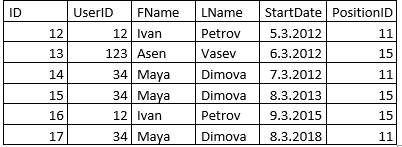
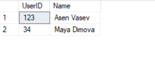
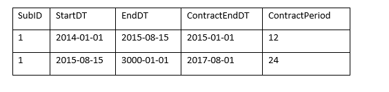
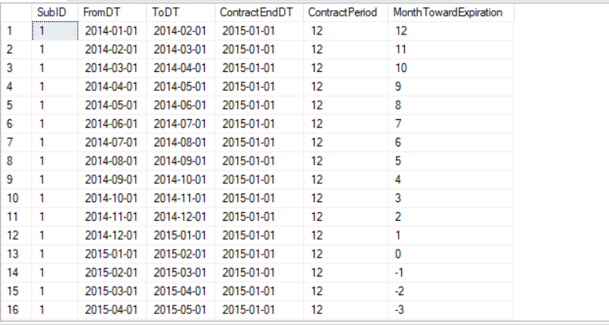

### Task 1
You are given table Staff, where you are provided with the company employees, the date, which they started a particular position and the position ID.
You should query all employees, which are occupying PositionID = 15 up to 01.01.2024.



```sql
WITH EmpLastPos AS (
    SELECT 
        UserID, 
        FName + ' ' + LName AS [Name],
        MAX(StartDate) AS StartDateLastPosition 
    FROM 
        Staff
    WHERE 
        StartDate <= '2014-01-01'
    GROUP BY 
        UserID, FName + ' ' + LName
)
SELECT 
    e.UserID, 
    e.Name
FROM 
    EmpLastPos e
JOIN 
    Staff s ON e.UserID = s.UserID 
            AND e.StartDateLastPosition = s.StartDate 
            AND s.PositionID = 15
ORDER BY 
    s.FName, s.LName ASC;
```



### Task 2
You are given table Contracts, where we have historical intervals of the long term contracts of our customers.
SubID – Id of the customer
StartDT – Start date of contract
EndDT – End date of contract
ContractEndDT –  End date of the customer's contract.
ContractPeriod – duration in months of the customer's contract
You should query the monthly status of the customer's contracts and more precisely - calculate months towards expiration in a new variable called MonthTowardExpiration, where
the interval FromDT – ToDT is one calendar month. 
The value of MonthTowardExpiration should be positive if the contract isn't expired, zero(0) if the contract expires at the given month and negative if the contract is already expired.



```sql
WITH ContractsId AS (
  SELECT 
    *,
    ROW_NUMBER() OVER (PARTITION BY SubID ORDER BY StartDT) AS ContractID
  FROM 
    Contracts
),
RecursiveMonths AS (
  SELECT 
    c.SubID,
    c.ContractID,
    DATEFROMPARTS(YEAR(c.StartDT), MONTH(c.StartDT),1) AS FromDT,
    DATEADD(day, 1, EOMONTH(c.StartDT)) AS ToDT,
    DATEFROMPARTS(YEAR(c.EndDT), MONTH(c.EndDT), 1) AS EndMonth,
    c.ContractPeriod,
	DATEFROMPARTS(YEAR(c.ContractEndDT), MONTH(c.ContractEndDT),1) as ContractEndDT
  FROM 
    ContractsId c
  UNION ALL
  SELECT 
    c.SubID,
    c.ContractID,
    DATEADD(month, 1, rm.FromDT),
    DATEADD(day, 1, EOMONTH(DATEADD(month, 1, rm.FromDT))),
    rm.EndMonth,
    c.ContractPeriod,
	DATEFROMPARTS(YEAR(c.ContractEndDT), MONTH(c.ContractEndDT),1) as ContractEndDT
  FROM 
    RecursiveMonths rm
  JOIN 
    ContractsID c ON c.SubID = rm.SubID AND c.ContractID = rm.ContractID
    AND DATEADD(month, 1, rm.FromDT) < rm.EndMonth
)

SELECT 
  SubID,
  FromDT,
  ToDT,
  ContractEndDT,
  ContractPeriod,
  DATEDIFF(MONTH, FromDT, ContractEndDT) as MonthTowardExpiration
FROM 
  RecursiveMonths
ORDER BY
  SubID,
  FromDT;
```

